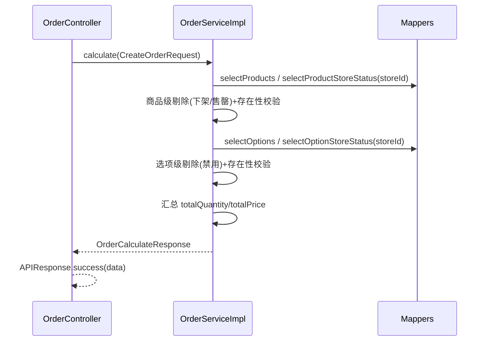

## 用户需求

重构 order 服务的 `calculate` 接口（确认订单页请求后端计算订单总价），由后端统一计算金额并在同一响应中完成订单内容校验与不可用项剔除通知。

## 产品概述

前端在确认订单页提交购物车（门店ID、就餐方式、商品列表）给后端，后端负责：

- 解析每个商品的 skuId 提取客制化选项ID；
- 结合四张表校验商品与客制化选项的可用性；
- 剔除不可用的商品/选项，并在响应中告知前端被剔除项；
- 对有效商品计算总数量与总价格（(商品单价+所选选项加价之和)×数量）。

## 核心功能

- 入参封装：新增 `CreateOrderRequest`（storeId、diningMethod、products 列表，每项含 id/skuId/quantity）。
- 响应封装：新增 `OrderCalculateResponse` 作为 data 字段，含 `unavailable`（不可用商品与客制化选项清单）、`totalQuantity`、`totalPrice`。
- skuId 解析：格式 `商品ID#项目ID_选项ID-项目ID_选项ID…`，提取客制化选项ID集合。
- 可用性校验与剔除：
- 商品全局下架(status=0) 或 门店售罄(无记录或 status=0) → 归入 unavailable.products，剔除；
- 客制化选项全局禁用(status=0) 或 门店禁用(无记录或 status=0) → 其所属商品整体剔除，选项归入 unavailable.customizationOptions。
- 存在性校验：商品ID查不到、或解析出的选项ID查不到 → 抛业务异常终止计算。
- 金额计算：仅对有效商品求和，totalQuantity=Σquantity，totalPrice=Σ(商品price+选项price之和)×quantity，BigDecimal 保留两位小数。

## 技术栈

- 后端：Spring Boot 3.5.16 + Spring Web + MyBatis 3.0.4 + Lombok，Java 21（沿用现有栈）。
- 持久层：MyBatis `@Select` 注解批量查询（参考现有 `ProductMapper.selectByIds` 的 foreach 写法）。
- 响应/异常：复用现有 `APIResponse`、`BizError`、`BizErrorCode`/`OrderErrorCode` 与 `GlobalExceptionHandler`。

## 实现方案

### 总体策略

保持 Controller→Service→Mapper 的分层结构不变，仅替换 DTO、补全 Mapper 查询、重写 `OrderServiceImpl.calculate`。计算与校验集中在 Service 一次完成，通过四次批量查询（商品、商品门店状态、客制化选项、客制化选项门店状态）避免 N+1。

### 关键决策

1. **DTO 替换而非增量**：废弃 `OrderCalculateRequest`/`CartItemDTO`，新增 `CreateOrderRequest` + `OrderProductItem` 严格对齐入参契约；新增 `OrderCalculateResponse` 及其内嵌 `unavailable` 结构对齐出参契约。
2. **懒加载默认值**：`product_store_status` 无记录=售罄(SOLD_OUT=0)；`customization_option_store_status` 无记录=禁用(0)。查询后构建 `productId/optionId → status` 映射，缺失即视为不可用——符合用户确认规则。
3. **错误语义分离**：「不存在」(not found) 抛 `BizError` 终止；「已下架/售罄/禁用」仅进 unavailable 列表不抛错——区分「数据非法」与「正常业务剔除」。
4. **枚举复用与新增**：门店状态复用具名枚举 `ProductStoreStatus`（0/1 语义一致）；选项全局状态新增 `CustomizationOptionGlobalStatus`（DISABLED=0/ACTIVE=1）保持项目枚举化惯例。
5. **金额精度**：全程 `BigDecimal`，`setScale(2, RoundingMode.HALF_UP)`，避免浮点误差。
6. **响应文案对齐契约**：`APIResponse.success` 默认 message 改为 `"成功"` 以匹配约定响应格式（当前为 `"success"`）。

### 性能与可靠性

- 4 次 IN 查询均为批量，商品数/选项数有限，时间复杂度 O(n)，无热点。
- 映射表用 `Map<Long,...>` 以 O(1) 查找，避免内层循环反复查库。
- 金额与数量累加使用 `BigDecimal`，防止精度与溢出。
- 无效 skuId 格式统一抛 `BizError`，由全局异常处理器转 APIResponse。

## 实现要点

- 仅查必要列并用 `AS` 别名做驼峰映射（项目未开启 mapUnderscoreToCamelCase），如 `product_id AS productId`、`store_id AS storeId`、`customization_option_id AS customizationOptionId`。
- `ProductMapper.selectByIds` 增补 `price` 列。
- 校验优先级：先判商品级不可用（命中则计入 products 列表，不再检查其选项）；否则解析并检查其全部选项，命中不可用则将整商品剔除并把对应选项计入 customizationOptions 列表。
- `diningMethod` 仅接收存储，本接口不参与计算。

## 架构设计

### 数据流



## 目录结构

```
src/main/java/cn/dextea/trade/
├── controller/
│   └── OrderController.java                              # [MODIFY] 入参改为 CreateOrderRequest，出参改为 APIResponse<OrderCalculateResponse>
├── service/
│   ├── OrderService.java                                 # [MODIFY] calculate(CreateOrderRequest) 返回 OrderCalculateResponse
│   └── impl/
│       └── OrderServiceImpl.java                         # [MODIFY] 重写计算+剔除逻辑，调用 Mapper 与 SkuIdParser
├── dto/
│   ├── OrderCalculateRequest.java                        # [DELETE] 废弃，由 CreateOrderRequest 替代
│   ├── CartItemDTO.java                                  # [DELETE] 废弃，不再使用
│   ├── CreateOrderRequest.java                           # [NEW] 入参：storeId、diningMethod、List<OrderProductItem> products
│   ├── OrderProductItem.java                             # [NEW] 商品项：Integer id、String skuId、Integer quantity
│   ├── OrderCalculateResponse.java                       # [NEW] 响应 data：unavailable、totalQuantity、BigDecimal totalPrice
│   ├── OrderCalculateUnavailable.java                    # [NEW] unavailable 封装：List<UnavailableProduct>、List<UnavailableCustomizationOption>
│   ├── UnavailableProduct.java                           # [NEW] 不可用商品：Long id、String name
│   └── UnavailableCustomizationOption.java               # [NEW] 不可用选项：Long optionId、String optionName、Long productId、String productName
├── util/
│   └── SkuIdParser.java                                  # [NEW] 静态解析 skuId → List<Long> 选项ID，格式非法抛 BizError
├── entity/enums/
│   └── CustomizationOptionGlobalStatus.java             # [NEW] 选项全局状态 DISABLED(0)/ACTIVE(1)
├── mapper/
│   ├── ProductMapper.java                                # [MODIFY] selectByIds 增补 price 列
│   ├── ProductStoreStatusMapper.java                     # [MODIFY] 新增 selectByProductIdsAndStoreId 批量查门店状态
│   ├── CustomizationOptionMapper.java                    # [MODIFY] 新增 selectByIds 查 id/name/price/status
│   └── CustomizationOptionStoreStatusMapper.java         # [MODIFY] 新增 selectByOptionIdsAndStoreId 批量查门店状态
├── error/
│   └── OrderErrorCode.java                               # [MODIFY] 新增 CUSTOMIZATION_OPTION_NOT_FOUND、SKU_INVALID 等错误码
└── common/
    └── APIResponse.java                                  # [MODIFY] success 默认 message 改为 "成功"
```

## 关键代码结构

```java
// CreateOrderRequest.java
@Data @Builder @NoArgsConstructor @AllArgsConstructor
public class CreateOrderRequest {
    private Long storeId;
    private String diningMethod;
    private List<OrderProductItem> products;
}

// OrderCalculateResponse.java
@Data @Builder @NoArgsConstructor @AllArgsConstructor
public class OrderCalculateResponse {
    private OrderCalculateUnavailable unavailable;
    private Integer totalQuantity;
    private BigDecimal totalPrice;
}

// SkuIdParser.java
public final class SkuIdParser {
    /** 从 skuId(格式 商品ID#项目ID_选项ID-项目ID_选项ID) 提取客制化选项ID；格式非法抛 BizError */
    public static List<Long> parseOptionIds(String skuId) { /* ... */ }
}
```