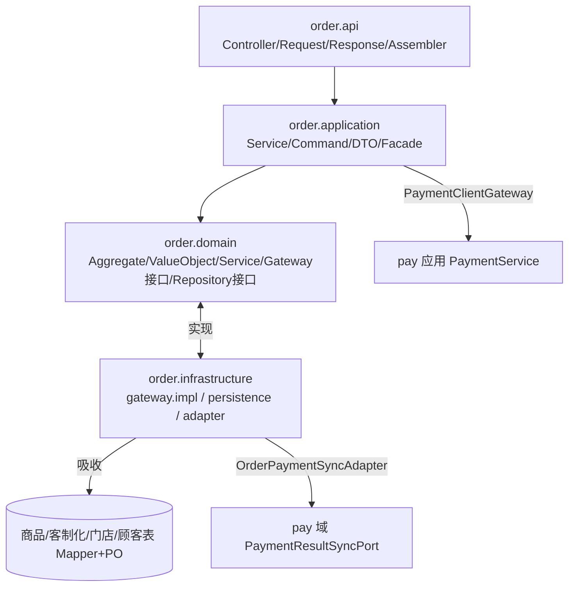

## 用户需求

将订单、商品、客制化、门店、顾客的业务都收敛到 `cn.dextea.trade.order` 单一包内，并按用户给定的四层 DDD 模板重构分层结构：

- `order/api`：接口层（controller 拆命令/查询、request/response DTO、OrderApiAssembler）
- `order/application`：应用层（应用服务、command、应用层 DTO、OrderAssembler、ExternalDataFacade 聚合外部网关调用）
- `order/domain`：领域层（聚合根 Order、实体 OrderItem、各类值对象含商品/客制化/门店/顾客快照、领域服务、OrderRepository 仓储接口、gateway 接口定义）
- `order/infrastructure`：基础设施层（persistence 订单持久化、gateway 实现-防腐层 ACL 落地：impl/mapper/po/translator、配置、异常）

## 产品概览

把原本分散在 `catalog`（商品/客制化/门店/顾客支撑域）和 `infrastructure.acl`（防腐层过渡产物）中的模型、枚举、Mapper、PO 全部吸收进 `order` 包，作为领域值对象与外部网关实现。重构后删除不符合新结构的旧包。

## 核心特性

- 商品/客制化/门店/顾客数据统一以"只读快照值对象"形式由订单领域通过 gateway 接口消费，不再依赖外部域持久化细节
- 订单接口层按读写职责拆分命令 Controller 与查询 Controller，DTO 分 request/response 子包
- 外部数据访问（商品/客制化/门店/顾客）由 `application` 的 `ExternalDataFacade` 统一编排聚合
- 保留与 pay 域的跨域协作（PaymentClientGateway 调用 pay 应用、OrderPaymentSyncAdapter 实现 pay 的 PaymentResultSyncPort）不变
- 删除 `cn.dextea.trade.catalog` 与 `cn.dextea.trade.infrastructure.acl` 整包及 order 旧的 `interfaces/port/adapter` 等不符合新结构的包
- 同步更新各级 README 反映新架构，`pay/common/health` 模块保持原样不动


## 技术栈

- 保持现有单模块 Maven 项目（`cn.dextea:trade`，Spring Boot 3.5.16，Java 21）
- 持久化：纯 MyBatis 注解 Mapper（沿用 `mybatis-spring-boot-starter 3.0.4`，**不引入** MyBatis-Plus / Caffeine / InventoryGateway 等模板 demo 中未使用的内容）
- 其他既有能力不变：Redis（幂等/锁）、CosId（订单号）、Nacos、支付宝 SDK、RocketMQ
- 根包：`cn.dextea.trade`，订单模块根包：`cn.dextea.trade.order`

## 实现方案

### 总体策略
在不做 Maven 多模块、不改动 `pay/common/health` 的前提下，对 `order` 包执行"吸收—重命名—删除"三步重构：
1. 将 `catalog` 的领域模型（Product/Customization/Customer/Store 等及 7 个枚举）与 `infrastructure.acl` 的 Mapper/PO 吸收为 `order.domain.model.valueobject`（只读快照）与 `order.infrastructure.gateway`（ACL 落地）。
2. 将 `order` 旧的 `interfaces/port/adapter` 分层按模板重命名为 `api/application/domain/infrastructure` 四层，端口接口（CatalogPort 等）改造为 `domain.gateway.*Gateway`，适配器落地为 `infrastructure.gateway.impl.*GatewayImpl`，仍委托既有 `CatalogMapper`/`CatalogPersistenceAdapter` 的 SQL 实现。
3. 删除 `catalog` 与 `infrastructure.acl` 两个不符合新结构的旧包，及 order 内旧分层残留。

### 关键决策与取舍
- **不新增 OrderPO/OrderPersistenceConverter 以外的持久化 PO 分层**：当前 `OrderMapper`/`OrderItemMapper` 已用注解直接映射领域对象，新增冗余 PO 反增维护成本；仅在 `infrastructure.gateway.mapper/po` 引入外部表 PO（吸收 acl 的 `*PO`/`*Mapper`）以符合 ACL 隔离原则。
- **gateway 粒度**：把 `CatalogPort`（含商品/客制化/门店/顾客四类快照）拆为 `ProductGateway`/`CustomizationGateway`/`StoreGateway`/`CustomerGateway` 四个领域网关接口，与用户模板的命名一一对应；支付/ID/锁等继续以 `PaymentClientGateway`/`OrderIdGeneratorGateway`/`OrderLockGateway` 接口形式存在，pay 域代码不动。
- **ExternalDataFacade**：在 `application.facade` 聚合四网关调用，供命令/查询服务只读取快照，避免服务层直接散落网关调用。
- **pay 双向协作保留**：`PaymentClientAdapter`（调 pay 的 `PaymentService`）与 `OrderPaymentSyncAdapter`（实现 pay 的 `PaymentResultSyncPort`）继续放在 `infrastructure.gateway.impl` 或 `infrastructure.adapter`，编译契约不变。

### 性能与可靠性
- 网关批量查询（`findProductsByIds` 等）已批量拉取，吸收后保持批量语义，避免 N+1。
- 删除包后需全量 `./mvnw compile` 校验编译；按"先领域→再基础设施→再应用/接口→最后删除"顺序执行，每步后可独立编译，缩小回归范围。
- 不改动 `pay/common/health`，控制爆炸半径；仅更新与删除包有 import 关系的 order 内文件。

## 架构设计

### 依赖方向（保持不变）
`api → application → domain ← infrastructure`
领域层零外部依赖，所有外部能力（DB、Redis、pay、商品/客制化/门店/顾客）经 `domain.gateway` 接口抽象，由 `infrastructure.gateway.impl` 实现。

### 模块协作（mermaid）


## 目录结构

> 仅列出将被创建/修改/删除的关键文件（`pay/common/health` 不在范围内）。

```
src/main/java/cn/dextea/trade/
├── order/
│   ├── api/                                  # [MODIFY/NEW] 接口层（原 interfaces 改名）
│   │   ├── controller/
│   │   │   ├── OrderCommandController.java   # [NEW] 写操作：create / pre-build
│   │   │   └── OrderQueryController.java     # [NEW] 读操作：列表 / 详情
│   │   ├── dto/
│   │   │   ├── request/                      # [NEW] CreateOrderRequest / PreBuildOrderRequest 等入参
│   │   │   └── response/                     # [NEW] OrderDetailResponse / OrderSummary / PreBuildOrderResponse 等出参
│   │   └── assembler/
│   │       └── OrderApiAssembler.java        # [NEW] Request->Command, Domain/应用DTO->Response
│   ├── application/                            # [MODIFY] 应用层（保持，按模板微调）
│   │   ├── service/
│   │   │   ├── OrderApplicationService.java  # [NEW 重命名] 原 OrderCommandService
│   │   │   ├── OrderQueryService.java        # [KEEP] 查询服务，绕过领域
│   │   │   └── impl/...
│   │   ├── command/                          # [KEEP] CreateOrderCommand 等
│   │   ├── dto/                              # [NEW] 应用层出参 DTO（OrderDetailDTO/OrderItemDTO 等，由现 OrderAssembler 产物提炼）
│   │   ├── assembler/
│   │   │   └── OrderAssembler.java           # [KEEP/微调] Command->Domain, Domain->应用DTO
│   │   └── facade/
│   │       └── ExternalDataFacade.java       # [NEW] 聚合 Product/Customization/Store/Customer 四个网关调用
│   ├── domain/                                # [MODIFY] 领域层（原 domain 更名内部分层）
│   │   ├── model/
│   │   │   ├── aggregate/Order.java          # [MOVE] 聚合根
│   │   │   ├── entity/OrderItem.java         # [MOVE] 实体
│   │   │   └── valueobject/                  # [NEW] 吸收 catalog 模型为只读快照
│   │   │       ├── Product.java              # [MOVE from catalog]
│   │   │       ├── ProductImage.java / Gallery.java / ProductStoreStatus.java
│   │   │       ├── Customization.java / CustomizationOption.java / CustomizationOptionStoreStatus.java
│   │   │       ├── Store.java / Customer.java
│   │   │       ├── Money.java / OrderStatus.java / Address.java  # [NEW/提炼] 金额/状态/地址值对象
│   │   │       └── 7 个状态枚举              # [MOVE from catalog enums]
│   │   ├── service/                          # [KEEP] OrderPlacementDomainService 等（更新 import 指向新 valueobject）
│   │   ├── repository/OrderRepository.java   # [KEEP] 仓储接口
│   │   └── gateway/                          # [NEW 重命名 port]
│   │       ├── ProductGateway.java           # [NEW] 原 CatalogPort 商品相关
│   │       ├── CustomizationGateway.java     # [NEW]
│   │       ├── StoreGateway.java             # [NEW]
│   │       ├── CustomerGateway.java          # [NEW]
│   │       ├── PaymentClientGateway.java     # [RENAME] 原 PaymentClientPort
│   │       ├── OrderIdGeneratorGateway.java  # [RENAME]
│   │       └── OrderLockGateway.java         # [RENAME]
│   ├── infrastructure/                        # [MODIFY]
│   │   ├── gateway/                           # [NEW 重命名 adapter] ACL 落地
│   │   │   ├── impl/
│   │   │   │   ├── ProductGatewayImpl.java    # [NEW] 委托 CatalogMapper
│   │   │   │   ├── CustomizationGatewayImpl.java
│   │   │   │   ├── StoreGatewayImpl.java
│   │   │   │   ├── CustomerGatewayImpl.java
│   │   │   │   ├── PaymentClientAdapter.java  # [MOVE] 调 pay
│   │   │   │   ├── OrderPaymentSyncAdapter.java # [MOVE] 实现 pay 的 PaymentResultSyncPort
│   │   │   │   ├── OrderIdGeneratorAdapter.java
│   │   │   │   └── OrderLockAdapter.java
│   │   │   ├── mapper/                       # [MOVE from acl + catalog] 外部表 Mapper
│   │   │   │   ├── ProductTableMapper.java / CustomizationTableMapper.java / CustomizationOptionTableMapper.java / StoreTableMapper.java / CustomerTableMapper.java
│   │   │   │   └── CatalogMapper.java        # [MOVE from catalog] 既有注解 SQL
│   │   │   ├── po/                           # [MOVE from acl] 外部表 PO
│   │   │   │   ├── ProductPO / CustomizationPO / CustomizationOptionPO / StorePO / CustomerPO
│   │   │   └── translator/                   # [MOVE/NEW] PO->值对象映射
│   │   │       ├── ProductTranslator.java / CustomizationTranslator.java / StoreTranslator.java / CustomerTranslator.java
│   │   ├── persistence/                       # [KEEP] 订单持久化
│   │   │   ├── mapper/OrderMapper.java / OrderItemMapper.java / OrderStatusLogMapper.java
│   │   │   ├── repository/OrderRepositoryImpl.java
│   │   │   └── converter/OrderPersistenceConverter.java  # [NEW] Order<->PO（如需要）
│   │   ├── config/                           # [KEEP/NEW] 既有配置类
│   │   └── exception/                        # [NEW] 基础设施异常转换
│   ├── interfaces/                            # [DELETE] 旧接口层，内容迁移到 api
│   └── ...旧 port/adapter 残包               # [DELETE]
├── catalog/                                   # [DELETE] 整包（吸收进 order）
└── infrastructure/acl/                        # [DELETE] 整包（吸收进 order.infrastructure.gateway）
```

## 实施注意事项

- 全仓搜索 `import cn.dextea.trade.catalog` 与 `import ...infrastructure.acl`，仅 order 内文件引用，逐一改为新包路径。
- `domain` 层严禁 import 任何 `infrastructure` 或 `catalog` 实现；所有对商品/客制化/门店/顾客的访问必须经由 `domain.gateway` 接口。
- `OrderPaymentSyncAdapter` 实现 pay 域接口，包移动后仍需 `@Component` 且实现类签名不变，确保 pay 回写链路可用。
- 删除 `catalog`/`acl` 前确认其无 `pay/common/health` 引用（已确认无）。
- README 同步：`trade/README.md`、`order/README.md` 重写为新四层结构；`catalog/README.md` 随包删除。


## Agent Extensions
### SubAgent
- **code-explorer**
  - Purpose: 重构执行前/执行中定位所有对 `catalog` 与 `infrastructure.acl` 的 import 引用、确认 pay 域无反向依赖、核对 gateway 方法签名与调用点
  - Expected outcome: 输出受影响文件清单与引用映射，保证删除旧包后无悬空 import、编译通过
