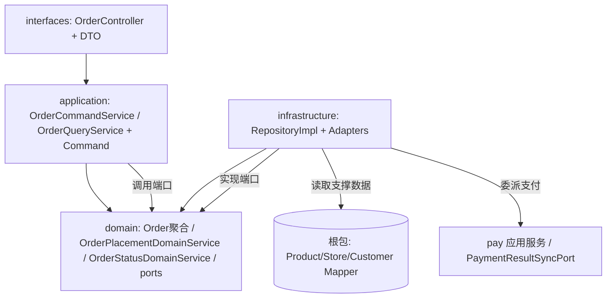

## 用户需求
pay 模块已完成 DDD 四层架构改造，order 模块仍为传统三层（controller/service/impl/entity/mapper/model），需参照 pay 完成 DDD 改造，形成统一的领域驱动设计结构。

## 产品概述
将 `cn.dextea.trade` 根包下散落的订单能力，重构为独立限界上下文 `cn.dextea.trade.order`，采用与 pay 一致的四层架构（interfaces / application / domain / infrastructure），依赖方向由外向内收敛于 domain。

## 核心特性
- **领域建模**：以 `Order` 为聚合根，承载订单状态、明细、计价与状态机流转规则；`OrderItem`、`OrderStatusLog` 作为聚合内实体/值对象；订单相关枚举（`TradeStatus`、`OrderEvent`、`MakingStatus`、`DiningMethod`）与状态机规则、错误码下沉至 domain 层。
- **端口隔离**：定义 `OrderRepository`（持久化）、`ProductCatalogPort`/`CustomerPort`/`StorePort`（商品目录等支撑数据防腐）、`PaymentClientPort`（调用支付）、`OrderIdGeneratorPort`（订单号生成）、`OrderLockPort`（分布式锁）等出站端口，由 infrastructure 实现。
- **应用编排**：应用层提供 `OrderCommandService`（创建/预构建）、`OrderQueryService`（列表/详情）与 Command 对象，编排领域服务与端口，保持对外 REST 接口、数据库表结构、幂等/锁机制与现有行为基本一致。
- **防腐与适配**：商品目录、顾客、门店等作为只读支撑数据保留在原位，通过 order 的 infrastructure 适配器经端口访问；支付回单同步 `OrderPaymentSyncAdapter` 迁移为 order 基础设施内实现 pay 端口的适配器，委托 order 领域服务完成状态流转。
- **接口层**：`OrderController` 与请求/响应 DTO 迁移至 order 的 interfaces 层，仅做结构归位，接口契约不变。


## 技术栈
- 语言/框架：Java 21 + Spring Boot 3 + MyBatis + Lombok（与现有项目一致）
- 架构模式：DDD 四层（interfaces / application / domain / infrastructure），参照已落地的 `cn.dextea.trade.pay` 样板
- 依赖设施：Redis（幂等缓存 + 分布式锁）、cosid（订单号生成）、RocketMQ（支付回单，经 pay 模块）、支付宝 SDK（经 pay 模块）

## 实现方案
### 总体策略
在根包下新建 `cn.dextea.trade.order` 限界上下文，按 pay 的四层结构平移订单能力：把聚合与业务规则沉淀到 `domain`，把 DB/外部调用/锁/ID 生成封装为 `infrastructure` 中的端口实现，应用层只做编排与事务边界控制，接口层只做协议转换。商品目录等支撑数据不纳入 order 聚合，而是通过防腐端口（ACL）按需查询，避免污染订单领域。

### 关键决策
1. **聚合根 `Order` 与持久化对象 `OrderPO` 分离**：domain 持有行为干净的 `Order` 聚合；infrastructure 用 `OrderPO` + MyBatis Mapper + Converter 做持久化适配，符合 DDD 持久化无关原则，也便于未来换存储。
2. **状态流转收敛到 `OrderStatusDomainService`**：原 `OrderStatusServiceImpl` 中的查询→状态机校验→CAS 更新→写日志→加锁逻辑，整体迁入领域服务，通过 `OrderRepository` 与 `OrderLockPort` 完成，去除对 `OrderMapper`/`OrderLockService` 的直接耦合。
3. **计价与校验归入 `OrderPlacementDomainService`**：原 `OrderServiceImpl.preBuild` 的 SKU 解析、目录可用性校验、计价、明细构建，迁移为领域服务，调用 `ProductCatalogPort`/`StorePort`/`CustomerPort` 获取只读快照，产出 `PreBuildResult` 值对象。
4. **支付调用改为端口 `PaymentClientPort`**：应用层不再直接依赖 pay 的 `PaymentService`，而是依赖 order domain 定义的 `PaymentClientPort`，由 infrastructure 适配器委派 pay 应用服务，降低跨域耦合、符合 pay 的端口契约。
5. **复用既有机制**：Redis 幂等缓存（`IDEMPOTENCY_KEY_PREFIX`/`IDEMPOTENCY_TTL`）、Redis 分布式锁（WAIT/LEASE 常量与 Lua 释放脚本）、cosid 生成器名 `order`、支付宝-only/微信不支持的拦截、`TradeStatusTransitionRules` 规则全部原样保留，仅做归属迁移。

### 性能与可靠性
- 预构建/下单仍采用「批量查商品/封面/客制化/状态」一次性加载（原 `loadAllEntities` 模式），避免 N+1；迁移时保持批量查询，不引入逐行查询。
- 状态变更保持 `SELECT + CAS(WHERE version=?)` + Redis 锁保护，幂等语义与并发安全不变。
- 迁移后务必保留 pay 回单链路（PAY/PAY_AND_FINISH/REFUND/CLOSE → 订单状态）的终态幂等跳过逻辑。

## 实现注意事项
- **枚举 code 值不可变**：`TradeStatus`/`OrderEvent`/`MakingStatus`/`DiningMethod` 的 `code`/`description` 必须与现有完全一致，避免 DB 存量数据与对外文案错乱；被其他模块引用的枚举暂不删除，保留桥接或在 domain 副本上兼容。
- **Mapper 平移**：`OrderMapper`/`OrderItemMapper`/`OrderStatusLogMapper` 改为操作 `OrderPO`，原 `@Select/@Insert` 注解中列名不变，仅实体类型替换；目录类 Mapper 保留在 `cn.dextea.trade.mapper`，由 order 适配器直接引用。
- **Bean 扫描与兼容**：删除旧根包 `service`/`service.impl`/`entity(Order系)`/`mapper(Order系)`/`model(Order系)`/`statemachine`/`errorcode(Order)`/`util` 后，确认无残留引用；`HealthController`/`HealthService` 等非订单代码保持不动。
- **事务边界**：下单写库 + 支付创建在应用服务内协调；状态变更事务保持在领域服务 `@Transactional` 方法上（同原 `OrderStatusServiceImpl.changeStatus`）。

## 架构设计
依赖方向（编译期）：`interfaces → application → domain`；`infrastructure → domain`（实现端口），infrastructure 可依赖根包支撑数据 Mapper。



## 目录结构
```
src/main/java/cn/dextea/trade/order/
├── application/
│   ├── OrderCommandService.java        # [NEW] 应用服务接口：createOrder / preBuildOrder
│   ├── OrderQueryService.java          # [NEW] 应用服务接口：getOrdersByCustomer / getOrderDetail
│   ├── command/
│   │   ├── CreateOrderCommand.java     # [NEW] 创建订单命令（由 Request 转换）
│   │   └── PreBuildOrderCommand.java   # [NEW] 预构建命令
│   └── impl/
│       ├── OrderCommandServiceImpl.java# [NEW] 编排下单：幂等→预构建→落库→支付端口
│       └── OrderQueryServiceImpl.java  # [NEW] 组装列表/详情响应（经 Repository + 端口）
├── domain/
│   ├── model/
│   │   ├── Order.java                  # [NEW] 聚合根，承载状态/明细/行为
│   │   ├── OrderItem.java              # [NEW] 聚合内明细实体/值对象
│   │   ├── OrderStatusLog.java         # [NEW] 状态变更日志值对象
│   │   ├── TradeStatus.java            # [NEW] 原 TradeStatusEnum
│   │   ├── OrderEvent.java             # [NEW] 原 OrderEventEnum
│   │   ├── MakingStatus.java           # [NEW] 原 MakingStatusEnum
│   │   ├── DiningMethod.java           # [NEW] 原 DiningMethodEnum
│   │   ├── PreBuildResult.java         # [NEW] 预构建结果值对象
│   │   └── PricedOrderItem.java        # [NEW] 计价明细值对象
│   ├── service/
│   │   ├── OrderPlacementDomainService.java # [NEW] 预构建校验/计价/明细构建
│   │   ├── OrderStatusDomainService.java    # [NEW] 状态机流转 + CAS + 日志 + 锁
│   │   └── OrderStatusMachine.java          # [NEW] 状态机规则（原 TradeStatusTransitionRules）
│   ├── port/
│   │   ├── OrderRepository.java        # [NEW] 持久化端口
│   │   ├── ProductCatalogPort.java     # [NEW] 商品/客制化目录查询（ACL）
│   │   ├── CustomerPort.java           # [NEW] 顾客查询
│   │   ├── StorePort.java              # [NEW] 门店查询
│   │   ├── PaymentClientPort.java      # [NEW] 调用支付（委派 pay）
│   │   ├── OrderIdGeneratorPort.java   # [NEW] 订单号生成（cosid）
│   │   └── OrderLockPort.java          # [NEW] 分布式锁
│   ├── exception/OrderErrorCode.java   # [NEW] 原 errorcode/OrderErrorCode
│   └── util/SkuIdParser.java           # [NEW] 原 util/SkuIdParser
├── infrastructure/
│   ├── persistence/
│   │   ├── OrderPO.java                # [NEW] 持久化对象（原 entity/Order）
│   │   ├── OrderItemPO.java            # [NEW]
│   │   ├── OrderStatusLogPO.java       # [NEW]
│   │   ├── OrderMapper.java            # [NEW] 操作 PO（原 mapper/OrderMapper）
│   │   ├── OrderItemMapper.java        # [NEW]
│   │   ├── OrderStatusLogMapper.java   # [NEW]
│   │   └── OrderRepositoryImpl.java    # [NEW] 实现 OrderRepository + PO↔Domain 转换
│   ├── adapter/
│   │   ├── ProductCatalogAdapter.java  # [NEW] 实现 ProductCatalogPort（调根包 Mapper）
│   │   ├── CustomerAdapter.java        # [NEW]
│   │   ├── StoreAdapter.java           # [NEW]
│   │   ├── PaymentClientAdapter.java   # [NEW] 实现 PaymentClientPort（调 pay PaymentService）
│   │   ├── OrderIdGeneratorAdapter.java# [NEW] cosid 实现
│   │   ├── OrderLockAdapter.java       # [NEW] Redis 锁（原 OrderLockServiceImpl）
│   │   └── OrderPaymentSyncAdapter.java # [NEW] 实现 pay 的 PaymentResultSyncPort，委托 OrderStatusDomainService
│   └── config/OrderInfrastructureConfig.java # [NEW] 必要 Bean 装配（@Component 可省）
└── interfaces/
    ├── controller/OrderController.java # [NEW] 迁移（协议不变）
    ├── dto/request/                    # [NEW] CreateOrderRequest / PreBuildOrderRequest
    ├── dto/response/                   # [NEW] CreateOrderResponse / PreBuildOrderResponse / OrderSummary / OrderDetailResponse / OrderDetailItem / StoreInfo / CreateOrderProductItem / CreateOrderUnavailable* 
    └── assembler/OrderAssembler.java   # [NEW] 聚合/值对象 ↔ DTO 转换

删除（迁移完成后移除根包旧类）：
- controller/OrderController.java
- service/OrderService.java, OrderStatusService.java, OrderLockService.java
- service/impl/OrderServiceImpl.java, OrderStatusServiceImpl.java, OrderLockServiceImpl.java, OrderPaymentSyncAdapter.java
- entity/Order.java, OrderItem.java, OrderStatusLog.java
- mapper/OrderMapper.java, OrderItemMapper.java, OrderStatusLogMapper.java
- model/*（订单相关 DTO）
- enums/OrderEventEnum.java, TradeStatusEnum.java, MakingStatusEnum.java, DiningMethodEnum.java（若被其他模块引用则保留桥接）
- errorcode/OrderErrorCode.java
- statemachine/TradeStatusTransitionRules.java
- util/SkuIdParser.java
```

## 关键代码结构
```java
// domain/model/Order.java —— 聚合根（节选接口）
public class Order {
    private Long id;
    private String orderNo;
    private String tradeNo;
    private String idempotencyKey;
    private Long customerId;
    private Long storeId;
    private TradeStatus tradeStatus;
    private MakingStatus makingStatus;
    private Integer version;
    private BigDecimal totalPrice;
    private Integer totalQuantity;
    private Integer payMethod;
    private DiningMethod diningMethod;
    private String note;
    private LocalDateTime paidAt;
    private LocalDateTime refundedAt;
    private List<OrderItem> items;
    // 工厂/行为：markPaid(tradeNo, paidAt)、markClosed()、canTransition(OrderEvent) 等
}

// domain/port/OrderRepository.java
public interface OrderRepository {
    Order save(Order order);                 // 首次落库 + 明细
    Order findByOrderNo(String orderNo);
    Order findById(Long id);
    Order findByIdempotencyKey(String key);
    void updateTradeNo(Long id, String tradeNo);
    int updateStatusCas(String orderNo, int target, int current, int version,
                        String tradeNo, LocalDateTime paidAt, LocalDateTime refundedAt);
    void insertStatusLog(OrderStatusLog log);
    List<Order> findByCustomerIdAndCreatedAfter(Long customerId, LocalDateTime since);
    List<OrderItem> findItemsByOrderId(Long orderId);
    List<OrderItem> findFullItemsByOrderId(Long orderId);
}

// domain/port/PaymentClientPort.java
public interface PaymentClientPort {
    String createPayment(String orderNo, BigDecimal totalPrice,
                         String customerOpenId, Integer totalQuantity, int platform);
}
```


## Agent Extensions
### Skill
- **cnb-code-commit**
  - Purpose: 在 order 模块 DDD 改造全部完成后，提交代码并创建 PR 归并到 refactor/pay-domain-model 分支
  - Expected outcome: 生成符合规范的提交与 PR，便于评审与持续集成
