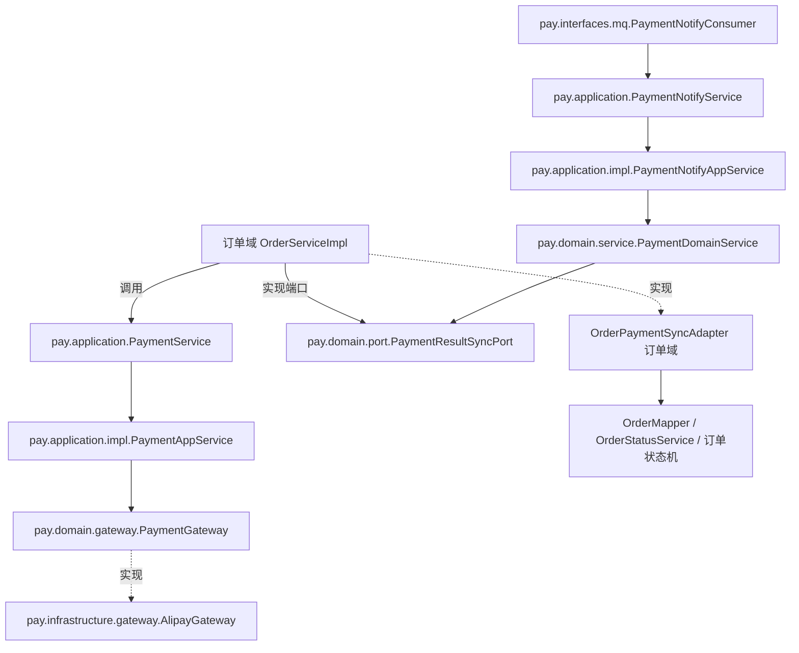

## 用户需求
在现有 Spring Boot 工程内新建独立包 `cn.dextea.trade.pay`，将全部"纯支付"代码迁移至该包下，并按照 DDD（领域驱动设计）思想重新组织为 interfaces / application / domain / infrastructure 四层。重构范围仅限纯支付代码，交易状态机（TradeStatusEnum、TradeStatusTransitionRules）与订单状态服务（OrderStatusService）留在原处；支付域通过端口（Port）接口反向驱动订单状态变更，实现解耦。业务行为保持不变，重构后工程可编译通过。

## 产品概述
将原本散落在 `service`、`mapper`、`config`、`factory`、`middleware`、`model`、`enums` 等按技术分层组织中的支付能力，聚合为单一支付子域（pay），对外暴露渠道无关的支付能力，对内屏蔽支付宝 SDK 细节，为后续接入微信支付等渠道预留扩展点。

## 核心特性
- 建立 `cn.dextea.trade.pay` DDD 四层包结构（interfaces / application / domain / infrastructure）
- 抽象 PaymentGateway 防腐层接口，由 AlipayGateway 实现，屏蔽支付宝 SDK 细节
- 抽象 PaymentResultSyncPort 端口，由订单域适配器实现，解耦支付域对订单内部类的依赖
- 抽象 Payment 领域对象与 PaymentResult 回单值对象，沉淀支付领域语义
- 从 OrderErrorCode 拆分 PayErrorCode，集中支付相关错误码
- 支付相关枚举（PayMethodEnum、PlatformEnum）、DTO（回单消息、创建交易命令）归入支付域
- 订单域仅依赖 pay 的对外接口/命令/枚举，不反向被支付域耦合；编译通过


## 技术栈
- 语言：Java 17；框架：Spring Boot（依赖注入、@ConfigurationProperties、组件扫描覆盖 `cn.dextea.trade.**`）
- 持久层：MyBatis（mapper 不迁移，仍属订单域）
- 消息：RocketMQ（支付回单消费端迁移至 pay.interfaces.mq）
- 三方 SDK：支付宝 Java SDK（com.alipay.v3），封装进 pay.infrastructure.gateway
- 工具：Lombok、Jackson（回单反序列化）
- 构建：Maven（mvnw），不对 pom.xml 做结构性调整，仅确认依赖已具备

## 实现方案
### 总体策略
在单工程内新建 `cn.dextea.trade.pay` 包，内部严格按 DDD 四层组织；通过"防腐层（ACL）+ 端口/适配器"消除支付域对订单域内部类（OrderMapper、OrderStatusService、TradeStatusEnum、OrderEventEnum、Order）的直接依赖，使 pay 域自洽且仅依赖订单域对外契约。

### 关键决策与权衡
1. ** PaymentGateway 防腐接口（domain.gateway）**：将原 `AlipayServiceImpl` 中"调用支付宝 SDK"的逻辑下沉为 `AlipayGateway implements PaymentGateway`。应用层的 `PaymentService` 仅依赖接口，将来新增微信支付只需新增 `WechatGateway implements PaymentGateway`，订单域调用方零改动。代价是增加一层间接，但符合开闭原则且风险可控。
2. ** PaymentResultSyncPort 端口（domain.port）**：支付域回单处理需驱动订单状态变更，这是反向依赖。将"同步支付结果"抽象为 pay 域定义的端口接口，由订单域的 `OrderPaymentSyncAdapter` 实现（使用 OrderMapper + OrderStatusService + TradeStatusEnum + OrderEventEnum）。pay 域只调用端口，完全不 import 订单内部类，依赖方向单向、无环。
3. ** 领域对象 Payment / PaymentResult**：把回单原始字段与"成功/关闭/是否已结算"判定收敛到 `PaymentDomainService`，产出渠道无关的 `PaymentResult`；订单事件映射（PAY / PAY_AND_FINISH / REFUND / CLOSE）与幂等判定交给适配器，确保支付域不含订单状态机知识。
4. ** 命名收敛**：`AlipayService`→`PaymentService`（渠道无关）、`CreateAlipayTradeRequest`→`CreatePaymentCommand`、`AlipayClientConfig`→`AlipayGatewayConfig`，表达领域语义、面向未来多渠道。

### 性能与可靠性
- 回单处理保持原有幂等与重试语义（ConsumeResult.SUCCESS/FAILURE、终态跳过、CAS 失败降级），仅调整调用路径，不改变执行逻辑与日志级别。
- 新增间接层为纯方法调用，无额外 I/O；组件扫描自动覆盖新包，无启动开销变化。
- 错误码拆分为 PayErrorCode，沿用现有 `BizError` 体系，不新增全局异常分支。

## 实现要点（防回归）
- 仅调整包路径与依赖方向，**不修改任何业务分支、SQL、MQ topic/consumerGroup、配置项 key（alipay.*、rocketmq.*）**。
- 全仓检索 `PayMethodEnum`、`PlatformEnum` 的引用（订单域的 Order/AbstractOrderRequest/OrderSummary/OrderDetailResponse/OrderServiceImpl 等），统一改为 `cn.dextea.trade.pay.domain.model` 的 import。
- `OrderServiceImpl` 中 `alipayService.createTrade(...)` 改为 `paymentService.createPayment(CreatePaymentCommand)`，并改用 `PayErrorCode` 中迁移过去的 ALIPAY_*/PAY_* 码。
- 保留 `@ComponentScan` 默认范围（基础包 `cn.dextea.trade`），pay 子包自动注册为 Spring Bean，无需新增扫描配置。
- 完成后以 `./mvnw -q compile` 校验全量编译，并以 `./mvnw -q spotless:check`（若工程配置了格式化）或人工核对 import 无遗漏。

## 架构设计
### 依赖关系

说明：pay 域仅向下依赖自身 domain/infrastructure，向上通过端口被订单域适配；订单域既调用 pay 对外服务，又实现 pay 的端口，依赖无环。

## 目录结构
```
src/main/java/cn/dextea/trade/
├── pay/                                      # [NEW] 支付子域根包（DDD 四层）
│   ├── interfaces/
│   │   ├── mq/
│   │   │   └── PaymentNotifyConsumer.java    # [MOVE] 原 middleware/PaymentNotifyConsumer，RocketMQ 回单消费入口
│   │   └── dto/
│   │       ├── PaymentNotifyMessage.java     # [MOVE] 原 model/PaymentNotifyMessage，回单 MQ 消息体
│   │       └── PaymentNotifyData.java         # [MOVE] 原 model/PaymentNotifyData，回单业务数据
│   ├── application/
│   │   ├── PaymentService.java               # [MOVE+重命名] 原 service/AlipayService，渠道无关对外支付接口
│   │   ├── PaymentNotifyService.java         # [MOVE] 原 service/PaymentNotifyService，回单处理应用接口
│   │   ├── impl/
│   │   │   ├── PaymentAppService.java         # [NEW] 实现 PaymentService，委派给 PaymentGateway
│   │   │   └── PaymentNotifyAppService.java   # [MOVE+重命名] 原 PaymentNotifyServiceImpl，编排回单用例（仅依赖 domain + port）
│   │   └── command/
│   │       └── CreatePaymentCommand.java     # [MOVE+重命名] 原 model/CreateAlipayTradeRequest，创建支付命令（渠道无关）
│   ├── domain/
│   │   ├── model/
│   │   │   ├── Payment.java                   # [NEW] 支付领域对象（outTradeNo/tradeNo/渠道/金额/状态）
│   │   │   ├── PaymentResult.java             # [NEW] 回单值对象（outTradeNo/tradeNo/渠道/rawStatus/success/settled）
│   │   │   ├── PayMethodEnum.java             # [MOVE] 原 enums/PayMethodEnum
│   │   │   └── PlatformEnum.java              # [MOVE] 原 enums/PlatformEnum
│   │   ├── gateway/
│   │   │   └── PaymentGateway.java            # [NEW] 防腐层接口：createPayment(CreatePaymentCommand) -> String tradeNo
│   │   ├── port/
│   │   │   └── PaymentResultSyncPort.java     # [NEW] 支付结果同步端口（由订单域实现）
│   │   ├── service/
│   │   │   └── PaymentDomainService.java      # [NEW] 解析回单、判定终态、调用同步端口
│   │   └── exception/
│   │       └── PayErrorCode.java              # [NEW] 从 OrderErrorCode 拆出的支付错误码
│   └── infrastructure/
│       ├── gateway/
│       │   └── AlipayGateway.java             # [MOVE+重命名] 原 service/impl/AlipayServiceImpl，实现 PaymentGateway，封装支付宝 SDK
│       ├── client/
│       │   └── AlipayClientFactory.java       # [MOVE] 原 factory/AlipayClientFactory，构建支付宝 ApiClient
│       └── config/
│           ├── AlipayGatewayConfig.java       # [MOVE+重命名] 原 config/AlipayClientConfig（@ConfigurationProperties prefix=alipay）
│           └── RocketMqConfig.java            # [MOVE] 原 config/RocketMqConfig（支付回单 MQ 配置）
├── service/
│   ├── OrderServiceImpl.java                 # [MODIFY] 改为依赖 pay.application.PaymentService / CreatePaymentCommand，错误码改用 PayErrorCode
│   ├── OrderPaymentSyncAdapter.java          # [NEW] 订单域实现 PaymentResultSyncPort（调用 OrderMapper + OrderStatusService + 状态机）
│   ├── impl/OrderStatusServiceImpl.java       # [MODIFY] import 调整（如引用了支付枚举）
│   └── ...（其他引用 PayMethodEnum/PlatformEnum 的订单域文件） # [MODIFY] 更新 import 到 pay.domain.model
├── model/
│   ├── AbstractOrderRequest.java              # [MODIFY] PlatformEnum import 改为 pay.domain.model
│   ├── OrderSummary.java / OrderDetailResponse.java / CreateOrderResponse.java # [MODIFY] import 调整
└── entity/Order.java                         # [MODIFY] 如引用 PayMethodEnum 则更新 import
```

## 关键代码结构
```java
// 防腐层接口：屏蔽支付宝 SDK，面向多渠道扩展
package cn.dextea.trade.pay.domain.gateway;
public interface PaymentGateway {
    String createPayment(CreatePaymentCommand command);
}

// 支付结果同步端口：由订单域适配，解耦 pay 对订单内部类的依赖
package cn.dextea.trade.pay.domain.port;
public interface PaymentResultSyncPort {
    void syncPaid(String outTradeNo, String tradeNo, boolean settled);
    void syncClosed(String outTradeNo);
}
```

