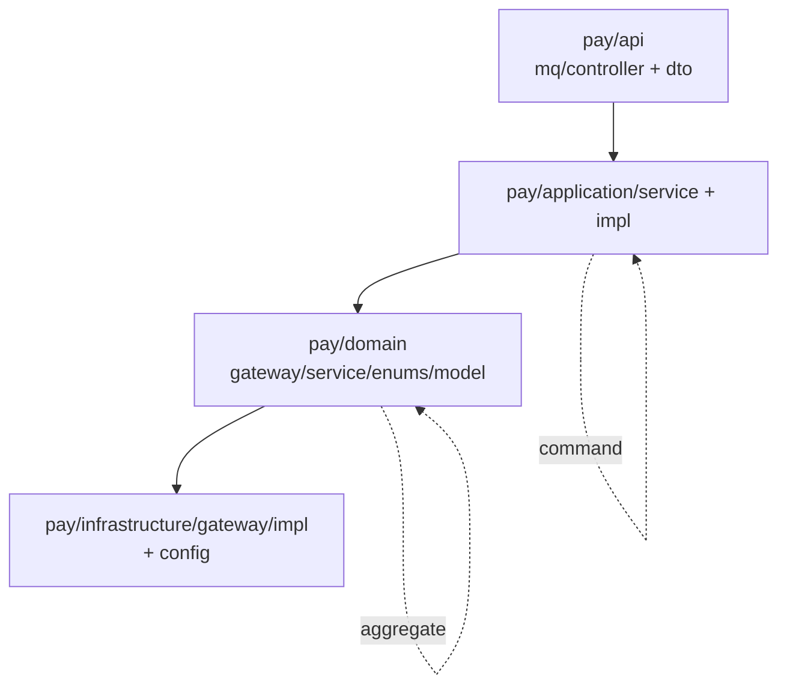

## 用户需求
以 `cn.dextea.trade.order` 包为示范标准，重构 `cn.dextea.trade.pay` 包的目录结构与命名规范，使两个包遵循一致的 DDD 分层与命名约定。本次为纯重构，不改变任何业务行为、接口签名与运行时逻辑。

## 产品概述
统一 order 与 pay 两个业务域的代码组织风格：入站适配层统一用 `api`、防腐/端口层统一用 `domain/gateway` 且接口以 `XxxGateway` 命名、应用层服务统一放在 `application/service` 及其 `impl` 子包、领域枚举统一放在 `domain/enums`、聚合根统一放在 `domain/model/aggregate`、基础设施实现统一放在 `infrastructure/gateway/impl`。

## 核心特性
- 目录对齐：pay 包的 `interfaces`→`api`、`port`→`gateway`、`application` 根接口→`application/service`、`application/impl`→`application/service/impl`、`infrastructure/adapter`→`infrastructure/gateway/impl`。
- 命名对齐：端口接口 `PaymentPort`→`PaymentGateway`、`PaymentResultSyncPort`→`PaymentResultSyncGateway`；枚举 `PlatformEnum` 移至 `domain/enums`；聚合根 `Payment` 移至 `domain/model/aggregate`；支付宝客户端实现命名为 `AlipayPaymentGatewayImpl`。
- 引用同步：更新 pay 包内部及 order 包中对 pay 包的所有 import 与 `implements` 引用。
- 编译校验：重构后通过 `./mvnw compile` 验证整体可编译。


## 技术栈
- Java 17 + Spring Boot + Maven 单模块工程，DDD 分层架构（api / application / domain / infrastructure）。
- 复用现有 Lombok（`@Builder`、`@Value`、`@RequiredArgsConstructor`、`@Slf4j`）与包结构约定，不引入新依赖或新框架。

## 实现策略
以 order 包为唯一范本，对 pay 包做机械式目录搬迁与类名/接口名重命名，同步修正所有 import 与 `implements` 关系。仅调整包路径与标识符，不修改方法签名、字段、逻辑与注解，保证行为零变更、编译零回归。

### 关键映射决策
1. `pay/interfaces/**` → `pay/api/**`（含 `dto`、`mq`）。order 的入站适配层为 `api`（controller/assembler/dto），MQ 消费者与 controller 同属入站适配，统一归入 `api/mq`。
2. `pay/domain/port/**` → `pay/domain/gateway/**`，`PaymentPort`→`PaymentGateway`、`PaymentResultSyncPort`→`PaymentResultSyncGateway`。order 使用 `domain/gateway` + `XxxGateway` 命名（如 `PaymentClientGateway`）。
3. `pay/application/PaymentService`、`PaymentCallbackService`（根接口）→ `pay/application/service/`；`pay/application/impl/**` → `pay/application/service/impl/**`。对齐 order 的 `application/service` + `application/service/impl` 分层。
4. `pay/domain/model/PlatformEnum` → `pay/domain/enums/PlatformEnum`。对齐 order 枚举集中放置于 `domain/enums`。
5. `pay/domain/model/Payment`（支付聚合根）→ `pay/domain/model/aggregate/Payment`；`PaymentResult` 为非聚合根的普通模型，保留在 `domain/model`（同 order 中 `PricedOrderItem` 等）。
6. `pay/infrastructure/adapter/AlipayPaymentClient` → `pay/infrastructure/gateway/impl/AlipayPaymentGatewayImpl`。依据 order 中 `CustomerGateway`→`CustomerGatewayImpl` 的命名惯例，实现 pay 自有 `PaymentGateway` 端口，采用 `XxxGatewayImpl` 后缀。
7. `infrastructure/config`（AlipayPaymentConfig、RocketMqConfig）保留原位（order 无 config 子包，但 common 下已有 config 先例，不影响一致性）。

## 实现注意事项
- **跨包引用必须同步**：order 包中有 7 处 import 指向 pay 旧路径，需全部更新：
  - `AbstractOrderRequest`、`OrderQueryServiceImpl`、`PreBuildOrderCommand`、`CreateOrderCommand`、`OrderApplicationServiceImpl`、`PaymentClientAdapter`：`pay.domain.model.PlatformEnum` → `pay.domain.enums.PlatformEnum`。
  - `PaymentClientAdapter`：`pay.application.PaymentService` → `pay.application.service.PaymentService`。
  - `OrderPaymentSyncAdapter`：`pay.domain.port.PaymentResultSyncPort` → `pay.domain.gateway.PaymentResultSyncGateway`，且 `implements PaymentResultSyncPort` → `implements PaymentResultSyncGateway`。
- **pay 内部引用同步**：`AlipayPaymentClient`、`PaymentPort` 中对 `Payment` 的 import 改为 `domain.model.aggregate.Payment`；`PaymentDomainService` 字段类型 `PaymentResultSyncPort`→`PaymentResultSyncGateway`；`AlipayPaymentClient` 的 `implements PaymentPort`→`implements PaymentGateway`；`PaymentCallbackConsumer` 的 `pay.interfaces.*` import 改为 `pay.api.*`。
- **安全与回归**：仅改包名/类名，不触碰业务逻辑、配置项、MQ topic/consumerGroup、支付宝 SDK 初始化；改动后必须 `./mvnw compile`（建议追加 `test`）确保全量编译通过。使用 Git 重命名（保留历史），避免误删文件。

## 架构设计
本任务为同构重构，不涉及架构调整。重构后 pay 包分层与 order 包完全对齐：



## 目录结构（pay 包变更清单）
```
src/main/java/cn/dextea/trade/
├── order/   # 仅改 import，结构不变
│   ├── api/dto/request/AbstractOrderRequest.java              # [MODIFY] PlatformEnum import → domain.enums
│   ├── application/command/CreateOrderCommand.java            # [MODIFY] PlatformEnum import
│   ├── application/command/PreBuildOrderCommand.java          # [MODIFY] PlatformEnum import
│   ├── application/service/impl/OrderApplicationServiceImpl.java # [MODIFY] PlatformEnum import
│   ├── application/service/impl/OrderQueryServiceImpl.java    # [MODIFY] PlatformEnum import
│   └── infrastructure/gateway/impl/
│       ├── PaymentClientAdapter.java                          # [MODIFY] PaymentService→application.service；PlatformEnum→enums
│       └── OrderPaymentSyncAdapter.java                       # [MODIFY] PaymentResultSyncPort→gateway.PaymentResultSyncGateway（import+implements）
└── pay/     # 结构/命名重构
    ├── api/                                       # [NEW] 由 interfaces 迁移
    │   ├── dto/PaymentCallbackData.java           # [MODIFY] 包路径 interfaces.dto→api.dto
    │   ├── dto/PaymentCallbackMessage.java        # [MODIFY] 包路径迁移
    │   └── mq/PaymentCallbackConsumer.java        # [MODIFY] 包路径 interfaces.mq→api.mq；pay.interfaces.*→pay.api.*
    ├── application/
    │   ├── service/PaymentService.java            # [MODIFY] 由 application 根迁入
    │   ├── service/PaymentCallbackService.java    # [MODIFY] 由 application 根迁入
    │   └── service/impl/
    │       ├── PaymentServiceImpl.java            # [MODIFY] 由 application/impl 迁入
    │       └── PaymentCallbackServiceImpl.java    # [MODIFY] 由 application/impl 迁入
    ├── domain/
    │   ├── enums/PlatformEnum.java                # [MODIFY] 由 domain.model 迁入
    │   ├── gateway/PaymentGateway.java            # [MODIFY] 由 domain.port.PaymentPort 重命名
    │   ├── gateway/PaymentResultSyncGateway.java  # [MODIFY] 由 domain.port.PaymentResultSyncPort 重命名
    │   ├── model/aggregate/Payment.java           # [MODIFY] 聚合根由 domain.model 迁入
    │   ├── model/PaymentResult.java               # [MODIFY] 包声明不变，保留 domain.model
    │   ├── service/PaymentDomainService.java      # [MODIFY] PaymentResultSyncPort→PaymentResultSyncGateway
    │   └── exception/PayErrorCode.java            # [MODIFY] 包声明不变
    └── infrastructure/
        ├── gateway/impl/AlipayPaymentGatewayImpl.java # [MODIFY] 由 adapter 迁入并重命名；implements PaymentGateway
        └── config/                                # [MODIFY] 不动（AlipayPaymentConfig、RocketMqConfig）
```
（pay 包旧路径 `interfaces/`、`application/impl/`、`domain/port/`、`domain/model/PlatformEnum.java`、`domain/model/Payment.java`、`infrastructure/adapter/` 通过 Git 重命名废弃。）

## 关键代码结构（仅类型重命名）
```java
// pay/domain/gateway/PaymentGateway.java（原 PaymentPort）
public interface PaymentGateway {
    String createPayment(Payment payment);
}

// pay/domain/gateway/PaymentResultSyncGateway.java（原 PaymentResultSyncPort）
public interface PaymentResultSyncGateway {
    void syncPaid(String orderNo, String tradeNo, boolean settled, String rawStatus, String traceId);
    void syncClosed(String orderNo, String traceId);
}
```


## Agent Extensions
### Skill
- **cnb-code-commit**
  - Purpose: 重构完成并通过编译后，将变更提交并创建 PR。
  - Expected outcome: 生成规范提交信息并创建 PR，便于代码评审与合入。
