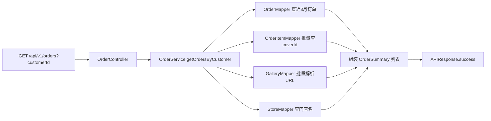

## 用户需求
创建一个获取订单的查询接口，用于查询指定用户在近 3 个月内的所有订单。

## 产品概述
新增一个只读查询接口，按用户 ID 拉取该用户最近 3 个月内产生的订单列表，并以精简结构返回订单概要与所购商品封面图。

## 核心功能
- 接口以 GET 方式提供，用户 ID（customerId）通过查询参数传入，路径为 `GET /api/v1/orders?customerId=123`。
- 查询范围为下单时间（created_at）在最近 3 个月内的订单，按下单时间倒序返回。
- 每条订单返回：门店名称（storeName）、下单时间（orderTime）、订单状态（status，仅数字状态码 int）、总价（totalPrice）、总数量（totalQuantity）。
- 每条订单额外返回一个数组（coverUrls），内含该订单所购商品的封面图 URL。
- 用户无订单时返回空列表；customerId 缺失由框架返回 400。


## 技术栈
- 框架：Spring Boot 3.5（Java 21）、Spring MVC、MyBatis 3.0.4
- 工具：Lombok、springdoc-openapi（Swagger 注解）、jakarta.validation
- 数据层：MySQL + MyBatis 注解式 Mapper
- 统一响应：`APIResponse<T>`

## 实现方案
### 整体策略
沿用项目既有分层（Controller → OrderService 接口 → OrderServiceImpl → Mapper），在 `OrderController` 新增一个 GET 端点，由 `OrderServiceImpl` 组装查询逻辑，复用已有 `StoreMapper`、`GalleryMapper` 解析门店名与封面 URL，避免引入新架构。

### 关键技术决策
- **HTTP 方法**：采用 GET + 查询参数，符合查询类接口语义，且与现有 POST 创建/预构建端点在同一路径下无冲突。
- **状态字段**：严格按确认仅返回 `Integer status`（订单原 int 值），不调用 `OrderStatusEnum` 的中文描述下发，保持响应精简且契约明确。
- **批量查询避免 N+1**：先一次性查出用户订单，再用 `OrderItemMapper.selectByOrderIds(List)` 批量获取所有订单项的 `cover_id`，最后用 `GalleryMapper.selectByIds` 批量解析 URL；门店名通过 `StoreMapper.selectById` 逐单解析（订单数有限，可接受；后续若需优化可改为批量门店查询）。
- **封面 URL 去重**：同一订单内多个订单项可能指向同一封面，按 orderId 分组后对内层 coverId 去重，减少 gallery 表查询与响应体积。
- **空结果处理**：无订单直接返回空列表，不做额外校验；customerId 缺失由 `@RequestParam(required = true)` 触发 400。

### 性能与可靠性
- 时间复杂度：订单查询 O(1)（带索引的 customer_id + created_at 范围），明细与画廊均为一次批量查询 O(n)。
- 瓶颈：门店名为逐单查询，订单量较大时可改为 `StoreMapper` 批量查询；当前按业务量评估无需提前优化（YAGNI）。
- 空安全：门店不存在时 `storeName` 置 null 而非抛异常，保证列表完整可用。

## 实现要点（执行注意）
- 复用 `OrderServiceImpl` 已注入的 `storeMapper`、`galleryMapper`、`orderMapper`、`orderItemMapper` 与既有 `loadCoverUrls` 思路，保持写法一致。
- Mapper 注解 SQL 中显式列出所需列，对齐 `StoreMapper`/`GalleryMapper` 的字段别名（如 `created_at AS createdAt`）风格。
- Swagger 注解使用 `@Operation` 补充接口说明，保持与现有端点一致。
- `since` 统一使用 `LocalDateTime.now().minusMonths(3)` 计算，避免时区歧义（与数据库 datetime 一致）。

## 架构设计
### 数据流
`GET /api/v1/orders?customerId=` → `OrderController.getOrders` → `OrderService.getOrdersByCustomer` →
1. `OrderMapper.selectByCustomerIdAndCreatedAtAfter` 取近 3 月订单
2. `OrderItemMapper.selectByOrderIds` 批量取 cover_id，按 orderId 分组（去重）
3. `GalleryMapper.selectByIds` 批量解析 URL 映射
4. `StoreMapper.selectById` 取门店名
5. 组装 `List<OrderSummary>` → `APIResponse.success(list)`



## 目录结构与文件改动
```
src/main/java/cn/dextea/trade/
├── model/
│   └── OrderSummary.java              # [NEW] 订单摘要响应单项。字段：storeName(String)、orderTime(LocalDateTime)、status(Integer,仅状态码)、totalPrice(BigDecimal)、totalQuantity(Integer)、coverUrls(List<String>)。使用 @Getter/@Setter/@Builder/@NoArgsConstructor/@AllArgsConstructor 与 @Schema 注解，风格对齐 CreateOrderResponse。
├── mapper/
│   ├── OrderMapper.java               # [MODIFY] 新增 selectByCustomerIdAndCreatedAtAfter(@Param("customerId") Long, @Param("since") LocalDateTime)，SELECT 指定列 WHERE customer_id=#{customerId} AND created_at >= #{since} ORDER BY created_at DESC，返回 List<Order>。
│   └── OrderItemMapper.java           # [MODIFY] 新增 selectByOrderIds(@Param("orderIds") List<Long>)，批量 SELECT order_id, cover_id FROM order_items WHERE order_id IN (...)，返回 List<OrderItem>（仅 orderId/coverId 有值，复用现有实体）。
├── service/
│   ├── OrderService.java              # [MODIFY] 接口新增 List<OrderSummary> getOrdersByCustomer(Long customerId)。
│   └── impl/OrderServiceImpl.java     # [MODIFY] 实现 getOrdersByCustomer：计算 since、批量查订单/明细/画廊/门店，分组去重封面，组装 OrderSummary 列表并空安全处理门店名。
└── controller/
    └── OrderController.java           # [MODIFY] 新增 GET 端点，@RequestParam(required=true) Long customerId，调用 service 后 APIResponse.success(list)，补充 @Operation 说明。
```

## 关键代码结构
```java
// OrderSummary.java 响应单项
@Getter @Setter @Builder @NoArgsConstructor @AllArgsConstructor
public class OrderSummary {
    private String storeName;          // 门店名称
    private LocalDateTime orderTime;   // 下单时间(createdAt)
    private Integer status;            // 订单状态码(int)，不附带中文描述
    private BigDecimal totalPrice;     // 总价
    private Integer totalQuantity;     // 总数量
    private List<String> coverUrls;    // 所购商品封面图 URL 列表
}
```

```java
// OrderMapper 新增
@Select("SELECT id, customer_id, store_id, status, total_price, total_quantity, created_at " +
        "FROM orders WHERE customer_id = #{customerId} AND created_at >= #{since} " +
        "ORDER BY created_at DESC")
List<Order> selectByCustomerIdAndCreatedAtAfter(@Param("customerId") Long customerId,
                                                @Param("since") LocalDateTime since);
```

