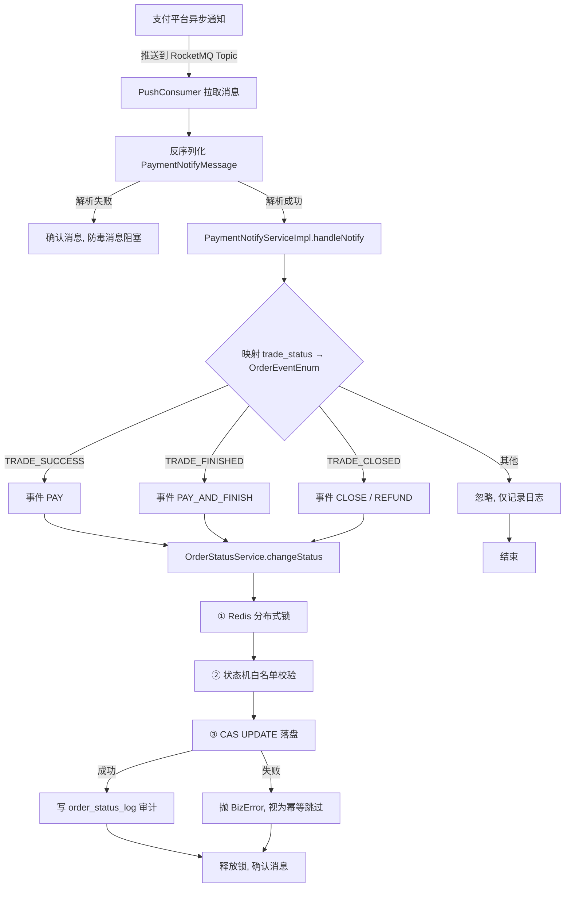

# 支付回单 → 订单状态更新 全链路机制与数据安全

本文档介绍系统从消息队列（RocketMQ）拉取支付平台回单、更新订单交易状态、并保证数据安全的完整链路。核心目标是：**支付成功绝不丢失、已支付绝不倒退、并发绝不覆盖、每笔变更可审计、链路可重试不阻塞。**

---

## 1. 链路总览



涉及的核心类：

| 环节 | 类 | 职责 |
|------|----|------|
| 消费接入 | `middleware/PaymentNotifyConsumer` | 订阅 Topic、反序列化、重试与确认 |
| 语义映射 | `service/impl/PaymentNotifyServiceImpl` | 回单 `trade_status` → 事件枚举 |
| 状态机 | `statemachine/TradeStatusTransitionRules` | `(当前状态, 事件) → 目标状态` 白名单 |
| 分布式锁 | `lock/OrderLockService` | 串行化同订单并发请求 |
| 统一入口 | `service/impl/OrderStatusServiceImpl` | 串联三层防护 + 审计日志 |
| 持久层 | `mapper/OrderMapper#updateStatusCas` | 带版本号的乐观更新 |
| 审计 | `mapper/OrderStatusLogMapper` | 写状态变更日志 |

---

## 2. 逐环解析

### 2.1 消息消费接入（PushConsumer）

`PaymentNotifyConsumer` 基于 RocketMQ 5.x Java SDK 的 Push 模式，由 SDK 管理并发度与线程分发。监听器逻辑（`handle` 方法）对异常做了分层处理：

- **消息体无法解析**（不可恢复）→ 直接 `ConsumeResult.SUCCESS` 确认，避免毒消息阻塞队列。
- **业务处理抛瞬时异常** → 返回 `ConsumeResult.FAILURE`，触发服务端重试。
- **处理成功** → `ConsumeResult.SUCCESS` 确认。

> 消费端是 **at-least-once**（至少一次投递），即同一条回单可能因重试被投递多次。因此「幂等」不是加分项，而是链路安全的底线要求——见 §3.1。

### 2.2 语义映射（回单 → 事件）

`PaymentNotifyServiceImpl.handleNotify` 把支付平台 `trade_status` 翻译成内部 `OrderEventEnum`：

| 平台 `trade_status` | 语义 | 映射事件 |
|---------------------|------|----------|
| `TRADE_SUCCESS` | 支付成功 | `PAY`（待支付 → 已支付） |
| `TRADE_FINISHED` | 交易结算（仍支持随时退款） | `PAY_AND_FINISH`（待支付 → 已结算） |
| `TRADE_CLOSED` | 关闭 | 按当前状态再分：`WAIT_PAY` → `CLOSE`（未付款关闭）；`PAID`/`FINISHED` → `REFUND`（支付后全额退款） |

本类**只做语义映射**，不再散落各种状态判断分支；所有「能不能变、变成什么」的规则都下沉到 `TradeStatusTransitionRules`。

### 2.3 三层防护（核心）

所有变更都经 `OrderStatusService.changeStatus` 单一入口，内部按顺序执行三层防护：

```java
orderLockService.executeWithLock(orderNo, () -> {
    Order order = orderMapper.selectByOrderNo(orderNo);          // 查当前状态
    TradeStatusEnum target = TradeStatusTransitionRules.getTarget(current, event); // ② 状态机
    if (target == null) throw 非法流转;
    int rows = orderMapper.updateStatusCas(..., currentVersion); // ③ CAS
    if (rows == 0) throw CAS 冲突;
    orderStatusLogMapper.insert(...);                            // 审计日志
    return null;
});
```

**① Redis 分布式锁**（`lock/OrderLockService`）
- 以 `order:lock:{orderNo}` 为 key，`SET key value NX EX 10` 原子加锁，最多等待 3 秒。
- 释放时用 Lua 脚本校验 `value` 后才 `DEL`，避免误删别人的锁。
- 作用：把同一订单的并发请求串行化，减少下游 CAS 冲突。

**② 状态机白名单**（`statemachine/TradeStatusTransitionRules`）
- 集中定义全部合法路径：

```text
WAIT_PAY  + PAY             → PAID
WAIT_PAY  + PAY_AND_FINISH  → FINISHED
WAIT_PAY  + CLOSE           → CLOSED
PAID      + REFUND          → REFUNDED
FINISHED  + REFUND          → REFUNDED
```

- 不在表中的组合返回 `null`，直接拒绝。**代码层面不存在把「已支付/已结算」改回「待支付」的任何路径。**

**③ CAS UPDATE（最终原子保障）**（`OrderMapper.updateStatusCas`）

```sql
UPDATE orders
SET trade_status = #{target}, version = version + 1, updated_at = NOW()
   [, trade_no = #{tradeNo}] [, paid_at = #{paidAt}] [, refunded_at = #{refundedAt}]
WHERE order_no = #{orderNo}
  AND trade_status = #{expectedStatus}   -- 前置状态必须匹配
  AND version = #{currentVersion};       -- 版本号必须匹配（防 ABA）
```

- `expectedStatus` 条件：只有当前确为「待支付」等前置态时，才允许改成目标态；已是终态则 `WHERE` 不命中，影响行数为 0。
- `version` 条件：两个并发请求即使读到相同状态，只有一个能命中当前 `version`，另一个返回 0，天然杜绝交叉写。
- 这是 InnoDB 行锁下的单条 SQL，原子性由数据库保证。

> 三层关系：**任何一层失效，后面的层都能兜住。** 锁因网络抖动失效 → CAS 兜底；状态机漏判 → CAS 的 `expectedStatus` 仍拦截；CAS 是最后一道、不可绕过的防线。

### 2.4 审计日志

每次成功变更都写一条 `order_status_log`，记录 `order_no / from_status / to_status / event / operator / version / created_at`。用途：
- 完整留存「谁、何时、把订单从哪个状态经什么事件变成哪个状态」，便于对账与排查。
- 配合 `version` 可还原状态演进时间序列。

---

## 3. 如何确保数据安全

| 风险 | 防御手段 | 失效兜底 |
|------|----------|----------|
| 重复消费（同一回单多次到达） | 终态幂等跳过 + CAS `WHERE trade_status=?` 返回 0 视为幂等 | 多层幂等，重复到达安全 |
| 并发覆盖（支付回调 vs 用户取消同时到） | Redis 锁串行化 | CAS `expectedStatus`/`version` 兜底 |
| 状态倒退（已支付 → 待支付） | 状态机白名单无此路径 + CAS 前置态校验 | 双保险，物理上不可发生 |
| ABA 问题（状态被绕一圈改回） | `version` 版本号每次 +1 | CAS `WHERE version=?` 拦截 |
| 锁误删（释放了别人的锁） | Lua 脚本校验持有者 `value` | 锁带 TTL 自动过期，不会死锁 |
| 持锁线程崩溃 | 锁 TTL=10s 自动过期 | 后续请求可重新加锁 |
| 消息丢失 / 消费失败 | 业务异常返回 `FAILURE` 触发 RocketMQ 重试 | 不可解析消息确认，避免毒消息 |
| 脏数据 / 非法流转 | 状态机白名单集中约束 | 抛 `ORDER_STATUS_TRANSITION_INVALID` |

### 3.1 幂等设计（重点）

支付平台为 at-least-once 投递，重复回调必然发生。本链路通过**三道幂等**保证重复到达安全：

1. **应用层终态判断**：进入变更前，若订单已是支付终态（已支付/已结算/已退款），直接 `return` 跳过。
2. **CAS 条件**：即使绕过第 1 道，`UPDATE ... WHERE trade_status = 待支付` 对已终态订单不命中，影响行数 0。
3. **异常处理兜底**：`changeStatus` 抛 `BizError` 后，`PaymentNotifyServiceImpl` 再次查询，若已是终态则记为「幂等跳过」，**不抛异常**，避免触发 MQ 无意义重试。

### 3.2 并发场景示例

「支付回调」与「用户取消」同时到达：

| 时刻 | 请求 A（支付回调） | 请求 B（用户取消） |
|------|-------------------|-------------------|
| T1 | 获取锁 `order:lock:123` ✅ | 尝试获取锁 → 阻塞等待 |
| T2 | 状态机校验 `WAIT_PAY+PAY` → `PAID` ✅ | — |
| T3 | CAS `WHERE version=0` 成功（version→1） | — |
| T4 | 写审计日志、释放锁 | — |
| T5 | — | 获取锁 ✅，查得状态=`PAID` |
| T6 | — | 状态机校验 `PAID+CLOSE` → 不在白名单 → 拒绝 |

若 Redis 锁因极端网络抖动完全失效，CAS 仍兜底：两个请求都读到 `WAIT_PAY/version=0`，请求 A CAS 成功（version→1），请求 B 的 `WHERE version=0` 不再命中，返回 0 → 抛 `ORDER_STATUS_CAS_FAILED`，数据安全不受影响。

### 3.3 可观测性建议

- 监控 `updateStatusCas` 返回 0 的比例，突增说明并发冲突加剧，需排查锁粒度或业务。
- 监控 `order_status_log` 中 `event=REFUND`、`event=CLOSE` 的时序，识别异常退款。
- `ORDER_STATUS_TRANSITION_INVALID` 命中即告警，可能是上游映射 bug 或攻击。

---

## 4. 线上部署注意事项

- **数据库迁移**：执行 `db/migration/V1__add_order_version_and_status_log.sql`，为 `orders` 加 `version` 列、建 `order_status_log` 表。存量订单 `version` 默认 0，CAS 仍可正常工作。
- **回滚兼容**：本特性为「向前兼容」增量——旧代码无 `version` 字段时仍可运行（`version` 有默认值）；新代码依赖 `version`，回滚前需确认 schema 已保留 `version` 列。
- **Redis 可用性**：Redis 不可用时锁获取失败会抛 `ORDER_LOCK_BUSY`，请求被拒；此时 CAS 不再有锁保护但仍正确，可接受短暂降级。建议 Redis 高可用部署。
- **消费端开关**：`rocketmq.enabled` 默认 `false`，生产环境置 `ROCKETMQ_ENABLED=true` 才启动消费端。

---

Back to: [docs/README.md](README.md) ｜ 相关：[Order-Creation-Flow-Analysis.md](Order-Creation-Flow-Analysis.md)
