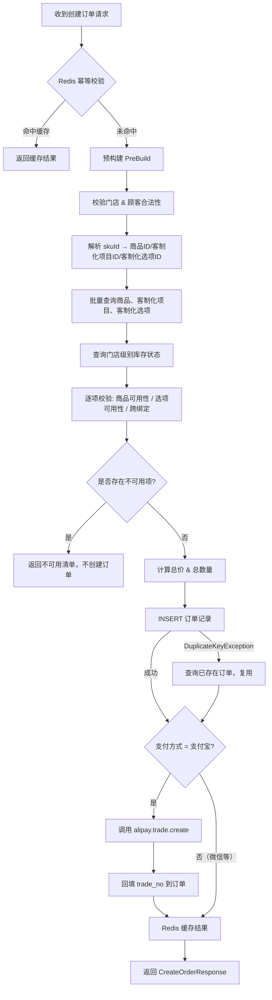

# 创建订单业务流程分析报告

## 当前流程概览



---

## 发现的问题

### 🔴 严重 Bug：`productIdList` 索引越界

这是最关键的一个逻辑 Bug。在 `preBuild` 方法中：

```217:266:/workspace/src/main/java/cn/dextea/trade/service/impl/OrderServiceImpl.java
    private PreBuildOrderResponse preBuild(CreateOrderRequest request) {
        // ...
        Set<Long> productIds = new LinkedHashSet<>();
        // ...
        for (CreateOrderProductItem item : items) {
            Long productId = SkuIdParser.parseProductId(item.getSkuId());
            // ...
            productIds.add(productId);
            // ...
        }
        // ...
        List<Long> productIdList = new ArrayList<>(productIds);  // ⚠️ Set 去重后可能比 items 短

        for (int i = 0; i < items.size(); i++) {
            // ...
            Long productId = productIdList.get(i);  // 🔴 当有重复商品时，这里会 IndexOutOfBoundsException!
```

**问题**：`productIds` 是 `LinkedHashSet`，会自动去重。当同一商品以不同客制化组合出现时（例如 `1#2_3` 和 `1#4_5`），`productIdList.size()` = 1，但 `items.size()` = 2，导致 `productIdList.get(1)` 越界。

**修复方向**：应该维护一个与 `items` 一一对应的 `productId` 列表，类似 `parsedOptionIds` 和 `parsedItemIds` 的做法。

---

### 🟡 订单明细（Line Items）缺失

`Order` 实体只存储了汇总信息：

```106:116:/workspace/src/main/java/cn/dextea/trade/service/impl/OrderServiceImpl.java
        Order order = Order.builder()
                .orderNo(idGenerator.generate())
                .tradeNo(null)
                .idempotencyKey(idempotencyKey)
                .customerId(request.getCustomerId())
                .storeId(request.getStoreId())
                .status(OrderStatus.PENDING.getCode())
                .payMethod(request.getPlatform().getPayMethod().getCode())
                .price(summary.getTotalPrice())
                .quantity(summary.getTotalQuantity())
                .build();
```

没有 `order_items` 表来记录具体的商品、客制化选项、单价和数量。这意味着订单创建后无从得知顾客具体买了什么。

---

### 🟡 无库存扣减

创建订单时没有扣减 `product_store_status` 表中的库存。这会导致超卖问题——同一商品可被多个订单同时购买而不受库存约束。

---

### 🟡 门店状态未校验

```343:348:/workspace/src/main/java/cn/dextea/trade/service/impl/OrderServiceImpl.java
    private void validateStore(Long storeId) {
        Store store = storeMapper.selectById(storeId);
        if (store == null) {
            throw new BizError(OrderErrorCode.STORE_ID_INVALID, "门店ID错误: " + storeId);
        }
    }
```

`Store` 实体有 `status` 字段，但从未被检查。已关闭/停业的门店仍然可以创建订单。

---

### 🟡 `diningMethod` 字段被丢弃

```35:37:/workspace/src/main/java/cn/dextea/trade/dto/CreateOrderRequest.java
    @NotBlank(message = "diningMethod 不能为空")
    @Schema(description = "仅支持 dine_in 和 takeout", example = "dine_in")
    private String diningMethod;
```

该字段经过 `@NotBlank` 校验，但在整个 `createOrder` 流程中从未被使用或持久化。`Order` 实体也没有对应字段。这意味着「堂食」和「外卖」的业务区分在订单层面丢失了。

---

### 🟡 `isOptionUnavailable` 中使用了语义错误的枚举

```456:462:/workspace/src/main/java/cn/dextea/trade/service/impl/OrderServiceImpl.java
    private boolean isOptionUnavailable(CustomizationOption option, Integer storeStatus) {
        boolean globalDisabled = option.getStatus() == null
                || option.getStatus() != CustomizationOptionGlobalStatus.ACTIVE.getCode();
        boolean storeDisabled = storeStatus == null
                || storeStatus != CustomizationOptionGlobalStatus.ACTIVE.getCode();
        return globalDisabled || storeDisabled;
    }
```

门店状态 `storeStatus` 来自 `customization_option_store_status` 表，应该与 `ProductStoreStatusEnum.AVAILABLE`（门店维度）比较，而不是与 `CustomizationOptionGlobalStatus.ACTIVE`（全局维度）比较。虽然两者数值恰好都是 1，但语义上不正确，容易在后续维护中引入 Bug。

---

### 🟢 竞态条件风险

从预构建校验到订单插入之间存在时间窗口，期间商品可能在另一个事务中被下架或售罄。当前没有锁定机制（如悲观锁/乐观锁）来防止这种情况。不过对于茶饮场景，这个风险相对可控。

---

## ✅ 流程中设计良好的部分

1. **幂等性设计完善**：Redis 快速校验 + MySQL 唯一索引兜底的双重保障，`DuplicateKeyException` 降级处理也很合理。
2. **SKU 解析设计清晰**：`SkuIdParser` 工具类封装了 skuId 的解析逻辑，格式非法时统一抛异常。
3. **不可用项优雅降级**：存在不可用商品/选项时不创建订单而是返回清单，允许客户端修正后重试。
4. **支付宝支付与订单创建分离**：支付宝 `trade_no` 在订单创建后异步回填，且有判空逻辑保证幂等。

---

## 总结

| 级别 | 问题 |
|------|------|
| 🔴 严重 | `productIdList.get(i)` 在重复商品场景下会 `IndexOutOfBoundsException` |
| 🟡 中等 | 缺少订单明细持久化、无库存扣减、门店状态未校验 |
| 🟡 中等 | `diningMethod` 字段被丢弃、`isOptionUnavailable` 使用错误枚举 |
| 🟢 轻微 | 预构建与落库之间存在竞态窗口（茶饮场景可接受） |

**整体评价**：核心幂等架构和 SKU 解析逻辑设计合理，但存在一个严重的功能性 Bug（`productIdList` 索引越界），以及一些业务完整性的缺失（订单明细、库存扣减、门店状态、diningMethod 等）。
